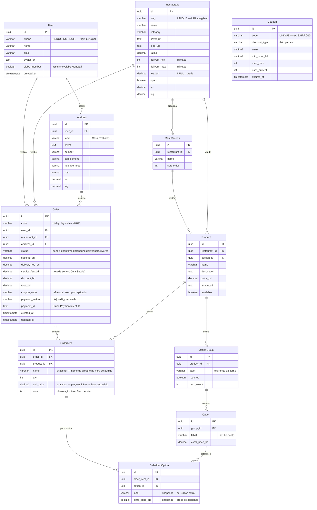

# Mandaaí — Entity Relationship Diagram

## Decisões de modelagem

### Snapshots em OrderItem e OrderItemOption

`OrderItem.name`, `OrderItem.unit_price`, `OrderItemOption.label` e `OrderItemOption.extra_price_brl`
são **cópias congeladas** no instante em que o pedido é criado. O restaurante pode alterar
preços ou renomear pratos a qualquer momento — o pedido precisa refletir o que o cliente
realmente pagou. As FKs `product_id` e `option_id` continuam existindo para rastreabilidade,
mas o sistema nunca deve usar o preço vivo do produto para exibir um pedido passado.

### OrderItemOption (junction table)

A tela 03 (Detalhe do Produto) mostra seleções de opções — "Ao ponto" (obrigatório),
"Bacon extra +R$ 5,00" (opcional) — que afetam o preço final do item. Serializar isso
no campo `note` impediria cálculo de preço e auditoria. A junction table
`OrderItemOption` captura cada opção escolhida com seu preço snapshot.

### `code` em Order

A tela 06 (Tracking) exibe "Pedido #4821" — um identificador sequencial legível para o
cliente e o restaurante. UUIDs são péssimos para comunicação verbal ("qual o número do
pedido?"), então `code` é um campo separado, gerado no momento da criação do pedido.

### `service_fee_brl` em Order

O resumo da sacola (tela 04) mostra "Taxa de serviço R$ 1,99" como linha distinta da
"Taxa de entrega". O schema original tinha apenas `fee_brl` — aqui separamos em
`delivery_fee_brl` e `service_fee_brl` para que o breakdown do pagamento corresponda
exatamente ao que o cliente vê.

### Coupon → Order (sem FK rígida)

`Order.coupon_code` é uma referência textual, não uma FK. Cupons podem expirar ou ser
removidos sem invalidar pedidos históricos. O desconto já está materializado em
`discount_brl`.

### Entidade Driver (Phase 2)

A tela de tracking mostra um card do entregador (nome, veículo, placa, coordenadas).
Essa entidade não está no ERD do MVP — será adicionada na Phase 2 junto com o
WebSocket de tracking em tempo real e o painel do lojista.
